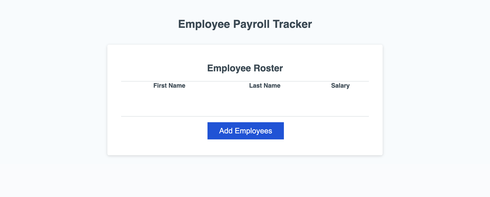
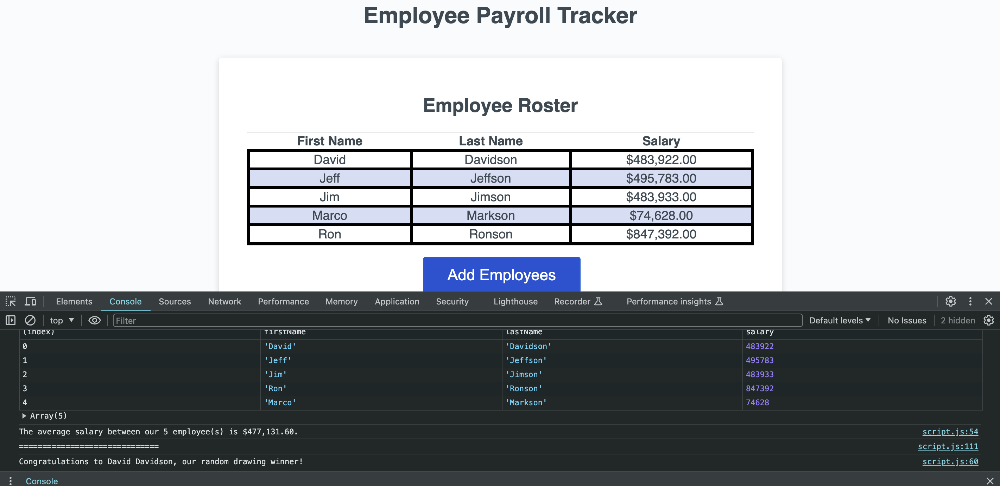

# <PAYROLL-TRACKER>

## Description

This project was built as a way for users to keep track of employee data and payroll.  The application prompts the user to enter employee information (first name, last name, and salary), and it records the data on a table, sorting alphabetically by employee's last name. 

Building this project presented several challenges.  On the surface, it was overwhelming and difficult to know where to start. Being presented with starter code for a portion of the project, I read through and identified what functions were already in place and noted the variables and arrays they were already slotted to use.  Then I utilized pseduocoding to the best of my ability and wrote a rough outline of what needed to be done: Prompts needed to come up to input employee information and it needed to loop until a user input forced the loop to cancel.  The employee information needed to then be displayed in the console.  The average salary of all the employees needed to be calculated, and finally a function that pulled a random employee would need to be executed.

The first thing I did was build the employee object, and then I did some research involving the "prompt" keyword and discovered the prompt function.  At that point it was a matter of plugging in the information in the correct syntax, and prompts started to appear on my page, but I needed them to loop.  It took a bit of trial and error with the while loop to understand and execute what needed to be wrapped in the loop, and I did have to close the browser a few times due to my loop running continuously.  My solution was creating a boolean variable that I could pass into the loop as the condition, and tie it to the "confirm" function that I used to ask if the user wanted to continue or not.  At the end of each loop run, the employee object was pushed into the array, and when the loop was finally finished running, it returned the completed Employees Array.  

The average employee salary and the random employee were simpler for me to think out the logic, but I did run into some issues having these functions access the employee object that I had previously declared within the collectEmployees function.  My solution was to declare the object globally so each function could see it no problem and access the correct information and display it correctly in the console.  An overall learning from this project was to really think through things just one piece at a time, collect my thoughts as clearly as I could, and document what I was doing and why I did it via comments in the code, and carefully read the starter code provided so I could see what variables were being used and what needed to be declared on my end in order to pass through the correct information to the existing functions.  

## Installation

N/A

## Usage

The application starts out with a blank table titled Employee Roster, and clicking the Add Employees button generates a prompt for the users to start entering information.  First the employee's first name, then last name, and finally salary.  For the salary field, the application is expecting a number, so entering a character other than a number will cause the application to default the input to 0.  A user can enter as many employees as they'd like.  After each round of adding employee information, the application asks if the user would like to add another.  Selecting 'OK' propels the application to continue prompting to enter more employee information.  When all the information has been added, the user can select the 'Cancel' option, and the data collected from the user will populate on the table. 

Opening the console at this point reveals a table and the employee object array have been logged to the console, as well as a calculation of the average salary among the (x) number of employees entered.  The application features a random employee function that, for each group entered, selects a random employee as a drawing winner and congratulates them in the console.

Click [here](https://lindsay-terry.github.io/payroll-tracker/) for deployed application.

## Credits

N/A

## License

N/A
